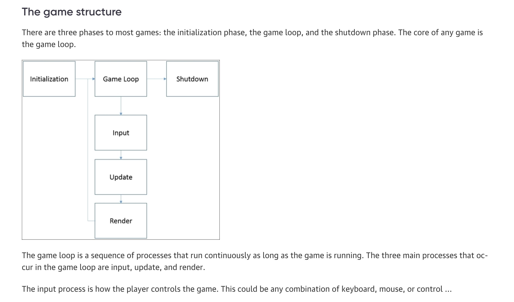

# Snake Game

## Live Game Link: https://codesandbox.io/s/snake-game-l1h2gb
## Something I learned

- Initialization: game start. Setup everything
- Shutdown: game over.
- Gameloop : during the game period.
    - Input: It can be user input. For example, in the snake game, user press "A" to let the snake turn left. 
    - Update: the computer received user's input and need to update the stage of the game. For example, after user press "A", the game update and the snake turn left.
    - Render: User can see the update/ changes visually
- [Window: requestAnimationFrame()](https://developer.mozilla.org/en-US/docs/Web/API/window/requestAnimationFrame): we often use this method to build the gameloop. This function is genrally better then setTimeInterval because it is more accurate. A good explanation about how requestAnimationFrame is better can be found here: https://stackoverflow.com/questions/38709923/why-is-requestanimationframe-better-than-setinterval-or-settimeout

